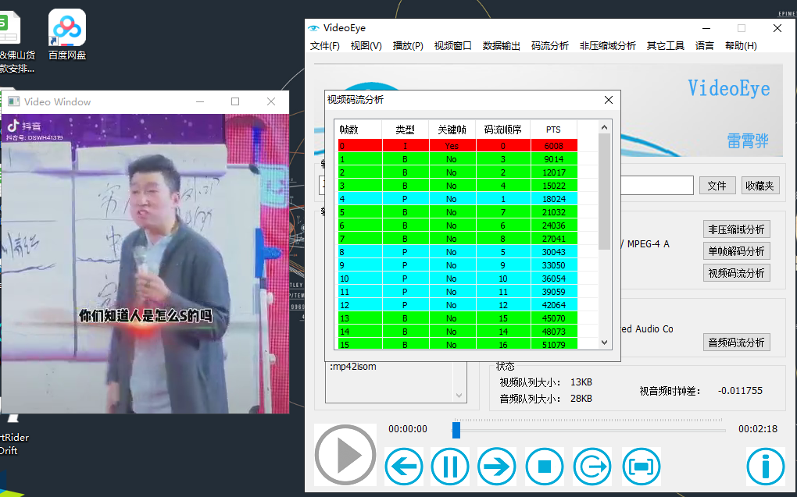

## 音视频


### 基础

[参考](https://juejin.cn/post/7005493877272477726)

#### 封装格式

> 封装格式也叫容器,将已经编码好的音频和视频按照一定格式放到一个文件中.


| 视频文件格式                             | 视频封装格式                       | 场景                                                                                                                                                                                |
| ---------------------------------------- | ---------------------------------- | ----------------------------------------------------------------------------------------------------------------------------------------------------------------------------------- |
| .avi                                     | AVI(Audio Video Interleave)        | 图像质量好，但体积过于庞大，压缩标准不统一，存在高低版本兼容问题。                                                                                                                  |
| .wmv                                     | WMV(Windows Media Video)           | 可边下载边播放，很适合网上播放和传输                                                                                                                                                |
| .mpg .mpeg .mpe .dat .vob .asf .3gp .mp4 | MPEG(Moving Picture Experts Group) | 由运动图像专家组制定的视频格式，有三个压缩标准，分别是 MPEG-1、MPEG-2、和 MPEG-4，它为了播放流式媒体的高质量视频而专门设计的，以求使用最少的数据获得最佳的图像质量。                |
| .mkv                                     | Matroska                           | 一种新的视频封装格式，它可将多种不同编码的视频及 16 条以上不同格式的音频和不同语言的字幕流封装到一个 Matroska Media 文件当中。                                                      |
| .rm、.rmvb                               | Real Video                         | Real Networks 公司所制定的音频视频压缩规范称为 Real Media。用户可以使用 RealPlayer 根据不同的网络传输速率制定出不同的压缩比率，从而实现在低速率的网络上进行影像数据实时传送和播放。 |
| .mov                                     | QuickTime File Format              | Apple 公司开发的一种视频格式，默认的播放器是苹果的 QuickTime。这种封装格式具有较高的压缩比率和较完美的视频清晰度等特点，并可以保存 alpha 通道。                                     |
| .flv                                     | Flash Video                        | 由 Adobe Flash 延伸出来的一种网络视频封装格式。这种格式被很多视频网站所采用。                                                                                                       |

#### 编码格式

> 将视频像素压缩成视频流,从而降低视频的数量,类似zip


| 名称            | 场景                                                                                                                                                                                                                                                                                                   |
| --------------- | ------------------------------------------------------------------------------------------------------------------------------------------------------------------------------------------------------------------------------------------------------------------------------------------------------ |
| **HEVC(H.265)** | 高效率视频编码(High Efficiency Video Coding，简称 HEVC)是一种视频压缩标准，是 H.264 的继任者。HEVC 被认为不仅提升图像质量，同时也能达到 H.264 两倍的压缩率（等同于同样画面质量下比特率减少了 50%），可支持 4K 分辨率甚至到超高画质电视，最高分辨率可达到 8192×4320（8K 分辨率），这是目前发展的趋势。 |
| **AVC(H.264)**  | 等同于 MPEG-4 第十部分，也被称为高级视频编码(Advanced Video Coding，简称 AVC)，是一种视频压缩标准，一种被广泛使用的高精度视频的录制、压缩和发布格式。该标准引入了一系列新的能够大大提高压缩性能的技术，并能够同时在高码率端和低码率端大大超越以前的诸标准。                                            |
| **MPEG4**       | 等同于`H.264`，是这两个编码组织合作诞生的标准。                                                                                                                                                                                                                                                        |
| **MPEG2**       | 等同于`H.262`，使用在 DVD、SVCD 和大多数数字视频广播系统和有线分布系统中。                                                                                                                                                                                                                             |
| **VP9**         |                                                                                                                                                                                                                                                                                                        |
| **VP8**         |                                                                                                                                                                                                                                                                                                        |
| **VC-1**        |                                                                                                                                                                                                                                                                                                        |

#### 音频

#### **不选择H265的原因**

> **iOS11.0**之后才支持**H265**。
> 相对于**H264**，**H265**对CPU造成的负荷更大，CPU发热更严重。

#### 编解码方式和封装格式的关系

> **「视频封装格式」= 视频 + 音频 +视频编解码方式 等信息的容器。**

一种「视频封装格式」可以支持多种「视频编解码方式」。比如：QuickTime File Format(.MOV) 支持几乎所有的「视频编解码方式」，MPEG(.MP4) 也支持相当广的「视频编解码方式」。

比较专业的说法可能是以 **A/B** 这种方式，**A 是「视频编解码方式」，B 是「视频封装格式」**。比如：一个 H.264/MOV 的视频文件，它的封装方式就是 QuickTime File Format，编码方式是 H.264。

### RBG&YUV

> rgb
> 

* yuv控制图片apk,支持放大,用作了解用
* 两种格式
* android输出和其他格式不一样

> 为什么视频不用rgb要用yuv?
> rgb基本用在图像的存储,并且十分简单,但是在视频领域中就基本不可能,因为视频都是一张张连续的图片排列组成的,假设视频是一分钟30帧1080p(1920*1080),用rgb存储需要(1920*1080*(3*8)*30*60)
> YUV同样使用三个分量来存储数据，他们分别是

* Y：用于表示明亮度（Luminance或Luma）
* U： 用于表示色度（Chrominance或Chroma）
* V：用于表示色度（Chrominance或Chroma）

> 为YUV图片的原图，下面的图片分别为只有Y分量、只有U分量、只有V分量数据的图片。可以看到只有Y分量的图片能够看清楚图片的轮廓，但图片是黑白的。[参考](https://www.jianshu.com/p/4fa388739e05)
> 
> 
> 

> yuv格式详解[参考](https://blog.csdn.net/xkuzhang/article/details/115423061)

### 宏块

### 帧

* **I帧**

> 关键帧,完整数据

* **B帧**

> 比例帧,百分比

* **P帧**

> 方向帧

**两个I帧之间称为GOP,图像序列**


### 码流

> 其实就是视频数据
> **I帧**后面跟着**P帧**,接着再是**B帧**,但实际播放的顺序是根据**pts**,解码顺序根据**dts**



### 编码流程

#### 底层元器件

* 视频解码器
  
* 信源编解码器
  

#### dsp

> cpu中的某个元器件
> 
> 有cpu为什么要单独设计个dsp?
> 因为cpu擅长计算,由于视频处理很复杂,数据量很庞大,如果把视频相关的数据放在cpu中,会占用资源,导致很卡,所以需要dsp
> **软解**:写代码解码,跑cpu,兼容性高,但是容易发烫,耗电量高,卡顿(FFmpeg)
> **硬解**:把数据传递给dsp,靠硬件解码,兼容性差,不发烫...(MediaPlayer,MediaCodec)
> 先硬解再软解[参考](https://www.cnblogs.com/nmj1986/p/9288674.html)

### 编码原理

#### 宏块划分与分组

#### 组内宏块查找

#### 帧内预测

> 方向

### 视频数据解析

#### h264


##### 数据分析

* 分隔符,每个分隔符之间称为NALU
  
  00 00 00 01/00 00 01,避免出现数据刚好相同,被误判,导致解码失败,如果编码器检测到NAL数据存在以下4种数据时，编码器会在最后个字节前插入一个新的字节0x03。

  ```
  0x 00 00 00 -->0x 00 00 03 00  --> 针对 0x 00 00 00 01的case
  0x 00 00 01 -->0x 00 00 03 01  --> 针对 0x 00 00 01的case
  0x 00 00 02 -->0x 00 00 03 02  --> 0x 00 00 02是协议的保留字段，将来可能会使用，所以也要加入防竞争字节
  0x 00 00 03 -->0x 00 00 03 03  --> 为了避免对原始数据中的0x 00 00 03进行脱壳操作，从而造成数据丢失
  ```
* 头信息,NALU Header
  sps(基础配置)
  pps(全量配置)
  
  
* forbidden_bit：禁止位(1)

> 编码中默认值为0，当网络识别此单元中存在比特错误时，可将其设为1，以便接收方丢掉该单元

* nal_reference_bit：重要性指示位(2)

> 值越大,越重要,sps/pps/I->11,p->10,b->01

* nal_unit_type：NALU类型位 (5)

##### 例子

0x67-1100111

[参考](http://blog.yundiantech.com/?log=blog&id=40)
[参考](https://zhuanlan.zhihu.com/p/511793341)
[参考](https://juejin.cn/post/7172132096733872158)
[参考](http://blog.yundiantech.com/?log=blog&id=40)
**[参考](https://yangandmore.github.io/2021/11/02/%E9%9F%B3%E8%A7%86%E9%A2%91%E7%BC%96%E8%A7%A3%E7%A0%81%E6%8A%80%E6%9C%AF%E5%9F%BA%E7%A1%80/)**
**[参考](https://juejin.cn/post/7009100729994444837)**

#### h265


> h265和h264差别
> H.265仍然采用混合编解码，编解码结构域H.264基本一致，
> 主要的不同在于：

* 编码块划分结构：采用CU (CodingUnit)、PU(PredictionUnit)和TU(TransformUnit)的递归结构。
* 基本细节：各功能块的内部细节有很多差异
* 并行工具：增加了Tile以及WPP等并行工具集以提高编码速度

##### 宏块划分

> 在H.265中，将宏块的大小从H.264的16×16扩展到了64×64，以便于高分辨率视频的压缩。
> 较复杂图片H.264和H.265区别不大,大面积相识度高的图片H.265比H.264好,并且压缩体积更优秀
> 

##### 帧内预测模式

> 本质上H.265是在H.264的预测方向基础上增加了更多的预测方向
> H.265：所有尺寸的CU块，亮度有35种预测方向，色度有5种预测方向
> H.264：亮度 4x4块9个方向，8x8块9个方向，16x16块4种方向，色度4种方向

##### 数据分析

> 分隔符和H264一样,头信息增加,两字节表示
> 相比H264,H265移除了nal_reference_bit,将此信息合并到nal_unit_type中
> 
> 

##### 例子

0x40 0x01-01000000 000000001
**[参考](https://blog.csdn.net/u014470361/article/details/89541544)**
**[参考](https://zhuanlan.zhihu.com/p/589739772)**
**[参考](https://blog.51cto.com/u_15077549/3366546)**

### 码流结构

> 宏观结构,图像-片组-片-NALU-宏块 -像素
> 

#### H264编码分层

* **NAL层:（Network Abstraction Layer,视频数据网络抽象层）**：  它的作用是H264只要在网络上传输，在传输的过程每个包以太网是1500字节，而H264的帧往往会大于1500字节，所以要进行拆包，将一个帧拆成多个包进行传输，所有的拆包或者组包都是通过NAL层去处理的。
* **VCL层:（Video Coding Layer,视频数据编码层）**： 对视频原始数据进行压缩

#### H264码流分层

> 切片头:包含了一组片的信息，比如片的数量，顺序等等
> pcm:音频
> 

**[参考](https://juejin.cn/post/7026972090049757214)**

## 哥伦布编码
>无损压缩,变长算法,比较适合小数字比大数字出现概率高的场景编码,并不是一味的为了减少内存占用,[参考](https://zh.wikipedia.org/wiki/%E6%8C%87%E6%95%B0%E5%93%A5%E4%BC%A6%E5%B8%83%E7%A0%81)
### 原理
| 源数据 | step1 | step2     | 编码结果  |
|-----|-------|-----------|-------|
| 0   | 0+1=1 | 1->二进制1   | 1     |
| 1   | 1+1=2 | 2->二进制10  | 010   |
| 3   | 3+1=4 | 4->二进制100 | 00100 |
step1.源数据+1,得到结果X  
step2.X转二进制,看1后面有Y位,在1前补Y个0  
**伦布编码优势**    
如果按字节表示,浪费空间较多(小数字>大数字的情况,两个1,一个255,字节表示需要3个字节,哥伦布编码只需要2个字节+1位)  
如果按位表示,只有0/1,限制较大

### 文档
doc/H.264视频编码官方中文帮助文档.pdf  
在H.264中，指数哥伦布编码有四个描述子，分别为ue(v)、se(v)、me(v)、te(v)。其中me(v)是最简单的，它直接靠查表来实现。而剩余的se(v)和te(v)，是在ue(v)的基础上来实现的  
[参考](https://blog.csdn.net/houxiaoni01/article/details/99844945)  
[参考](https://blog.51cto.com/u_12204415/3804218)  
[参考](https://blog.51cto.com/u_13267193/5377091)
* **ue(v)无符号整数指数哥伦布码编码**  
上述原理
* **se(v)有符号整数指数哥伦布码编码**  
se(v)需要先调用ue(v)得到codeNum，然后再调用se(v)的过程.  
value = (-1)^(codeNum+1) * (codeNum+1)/2;  
(-1)^(codeNum+1)：表示如果codeNum为奇数那么是1，偶数为-1  
* **te(v)舍位指数哥伦布码编码语**  
  te(v)需要先判断范围
  ```c
  // 1.判断取值上限
  if( x == 1 ) // 如果为1则将读取到的比特值取反
  {
  return 1 - bs_read_u1( b );
  }
  else if( x > 1 ) // 否则按照ue(v)进行解码
  {
  return bs_read_ue( b );
  }
  return 0;
  ```
  
  

### 实例
[参考](https://zhuanlan.zhihu.com/p/27896239)
> **videlfile/16.h264 16*16**
>
> 42:01000010
> profile_idc u(8):66,编码等级,直播
>
> C0:11000000
> flag u(1+1+1+1+4):
>
> 29:00101001
> level_idc u(8):41,最大支持码流范围,Supports 2Kx1K format
>
> 8D:10001101
> seq_parameter_set_id ue(v):1->0,sps id,通过该id值,图像参数集pps可以引用其代表的sps中的参数  
> log2_max_frame_num_minus4 ue(v):0001101->12,用于计算MaxFrameNum的值  
> ``计算公式为MaxFrameNum = 2^(log2_max_frame_num_minus4 + 4)。MaxFrameNum是frame_num的上限值，frame_num是图像序号的一种表示方法，在帧间编码中常用作一种参考帧标记的手段。``
>
> 69:01101001  
> pic_order_cnt_type ue(v):011->2,表示解码picture order count(POC)的方法。POC是另一种计量图像序号的方式，与frame_num有着不同的计算方法。该语法元素的取值为0、1或2。    
> num_ref_frames ue(v):010->1,用于表示参考帧的最大数目。    
> gaps_in_frame_num_value_allowed_flag u(1):0,标识位，说明frame_num中是否允许不连续的值。  
> pic_width_in_mbs_minus1 ue(v):1->0,(0+1)*16=16,宽度.由于宽度不可能为0,所以定义需要+1    
>
> E9:11101001  
> pic_height_in_map_units_minus1 ue(v):1->0,(0+1)*16=16,高度  
> frame_mbs_only_flag u(1):1,当该标识位为0时，宏块可能为帧编码或场编码；该标识位为1时，所有宏块都采用帧编码  
> 

> **videlfile/test.h264  3840*2160**
>
> 64:01100100  
> profile_idc u(8):100,编码等级,High (FRExt)
>
> 00:00000000  
> flag u(1+1+1+1+4):
>
> 33:00110011  
> level_idc u(8):51,最大支持码流范围,Supports 4096x2304 format
>
> AC:10101100  
> seq_parameter_set_id ue(v):1->0,序列参数集的id  
> chroma_format_idc ue(v):010->1,与亮度取样对应的色度取样,4:2:0  
> bit_depth_luma_minus8 ue(v):1->0,视频位深,0  High 只支持8bit  
> bit_depth_chroma_minus8 ue(v):1->0,  
> qpprime_y_zero_transform_bypass_flag u(1):0  
> seq_scaling_matrix_present_flag u(1):0  
>
> B4:10110100  
> log2_max_frame_num_minus4 ue(v):1->0,  
> pic_order_cnt_type ue(v):011->2  
> num_ref_frames ue(v):010->1  
> gaps_in_frame_num_value_allowed_flag u(1):0  
>
> 01:00000001  
> E0:11100000  
> pic_width_in_mbs_minus1 ue(v):000000011110000->239,(239+1)*16=3480宽度
>
> 02:00000010  
> 1F:00011111  
> pic_height_in_map_units_minus1 ue(v):000000010000111->134,(134+1)*16=2160
> 
